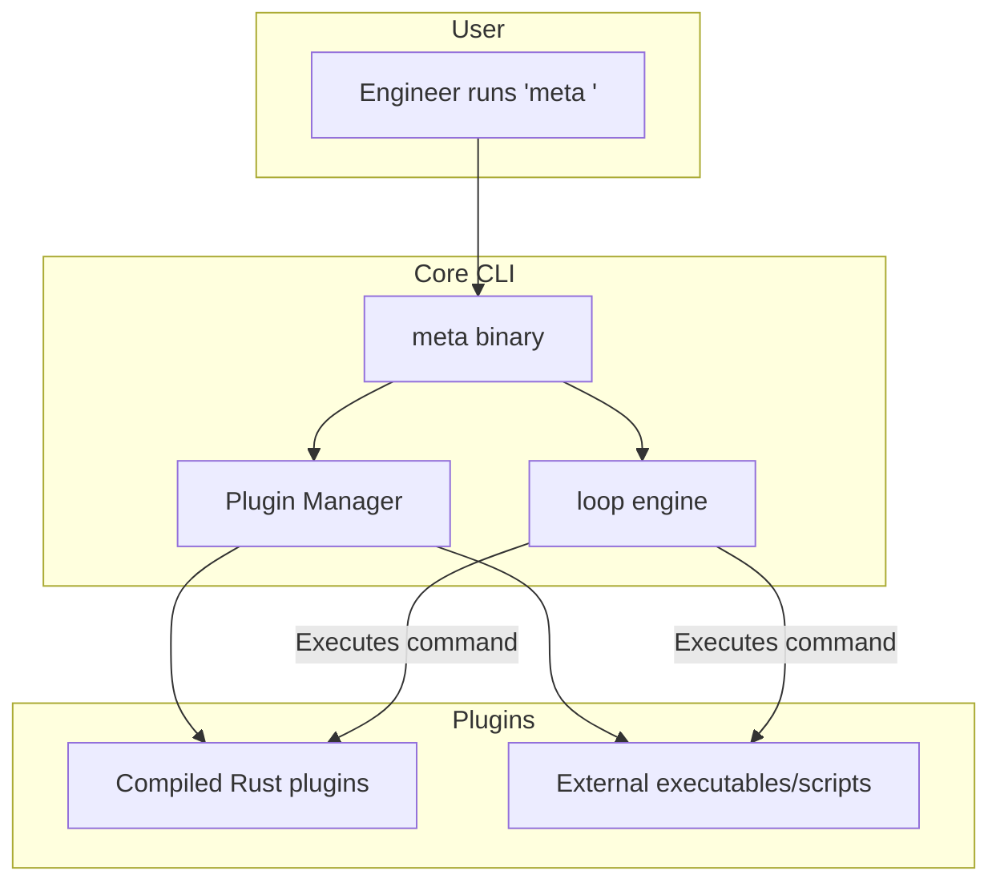

# Vision and Architecture Plan for `meta` Rust Rewrite

## Overview

Reimagine `meta` as a **highly-performant, portable, and extensible CLI platform** for **all engineers**. It will:

- Provide a **core CLI** that can run **any command** across multiple directories, leveraging a powerful filtering engine (`loop`).
- Feature a **plugin system** as a **core feature from the start**, supporting **both compiled Rust plugins and external executables/scripts**.
- Enable **immediate utility** out of the box, but be **powerfully extensible**.
- Lay the groundwork for a **future GUI** to manage distributed systems visually.

---

## Key Architectural Principles

### Core CLI (`meta`)
- Built on top of a **loop** engine that iterates directories and executes commands.
- Supports **native subcommands** (e.g., `meta pwd`) without requiring explicit `exec`.
- Provides **filtering** (`--include-only`, `--exclude`) to target subsets of directories.
- Reads a `.meta` file (JSON) to define project structure, but **not limited** to Meta-repo workflows.

### Plugin System
- **Core feature from day one**.
- Supports **compiled Rust dynamic libraries** *and* **external executables/scripts**.
- Plugins can **add, override, or extend** subcommands.
- Plugin discovery from:
  - `.meta-plugins` directory in project
  - User's home directory
  - System PATH (for executables/scripts)
- Example: `meta git clone` handled by `meta-git` plugin, `meta npm install` by `meta-npm`.

### Extensibility
- Encourage community and internal development of plugins.
- Plugins can be distributed as crates, binaries, or scripts.
- CLI designed to **fallback gracefully** if a plugin is missing.

### Future GUI
- CLI-first, but architecture supports a **future GUI**.
- GUI will interface with the same core libraries and plugin APIs.
- Enables visual management of distributed systems, slices, and workflows.

---

## Updated Context Summary

- **Who you are**: Expert Rust CLI and systems developer.
- **Project vision**: As above.
- **Design principles**:
  - Idiomatic, modular Rust
  - Intuitive CLI UX
  - Extensible plugin architecture
  - Cross-platform, portable binaries
  - Robust error handling, clear messaging
- **Scope**:
  - General-purpose CLI platform
  - Meta-repo management as a **use case**, not the sole focus
  - Plugin system **core from start**
  - GUI as **future phase**
- **Goals**:
  - Replace Node.js meta ecosystem with a **more powerful, flexible, and performant** Rust platform.
  - Support **all engineers** managing complex directory structures or distributed systems.
- **Non-goals**:
  - Tied to Node.js ecosystem
  - Plugin system as an afterthought

---

## Implementation Phases

### Phase 1: Core CLI + Plugin System
- Implement **loop** core for directory iteration and command execution.
- Design **plugin API** supporting:
  - Rust dynamic libraries (dlopen)
  - External executables/scripts (PATH discovery)
- Implement **plugin discovery and dispatch**.
- Support **native commands** (e.g., `meta pwd`) and **plugin commands** seamlessly.
- Implement `.meta` file parsing for project structure, but **not required** for all commands.

### Phase 2: Foundational Plugins
- `meta-git`: clone, status, checkout, update
- `meta-npm`, `meta-yarn`: install, update
- `meta-exec`: fallback for arbitrary commands (if needed)
- `meta-project`: sync, update, manage projects

### Phase 3: Polish & Distribution
- Cross-platform builds
- CI/CD pipelines
- Package manager distribution (Homebrew, Chocolatey, etc.)
- Documentation and examples

### Phase 4: Future Enhancements
- Performance optimizations
- Interactive modes
- Command suggestions
- **GUI development**

---

## High-Level Architecture Diagram

---

## Plugin Architecture Details

### Plugin API Design
- Support **both**:
  - **Compiled Rust dynamic libraries** loaded via `libloading`, exposing a minimal, stable C-compatible ABI.
  - **External executables/scripts** invoked via CLI conventions (e.g., `meta-<plugin>`), with well-defined argument/output protocols.
- **Plugin metadata**:
  - For Rust plugins: via manifest file (`plugin.toml`) or exported metadata function.
  - For external plugins: via help output or sidecar file.
- Design ABI and CLI protocols to be **minimal and stable** for long-term compatibility.

### Plugin Capabilities
- Initially, plugins **add or override commands**.
- Future support may include **intercepting or modifying** command dispatch via hooks/middleware.

### Plugin Discovery Precedence
1. Project-local `.meta-plugins` directory (highest priority)
2. User-level plugin directory (e.g., `~/.meta/plugins`)
3. System PATH (lowest priority)

### Security Considerations
- Plugins run with **full user permissions**.
- Users are responsible for plugin trust.
- Optionally warn on untrusted external scripts.
- Future: consider plugin signing or permission prompts.

### GUI Scope
- The GUI will be a **child repo** within the `meta-rust` meta repo.
- It will interface with CLI core and plugins via APIs or CLI commands.
- Allows independent development and release cycles.

---

## Installation and Distribution Plan

### Core CLI (`meta`)
- **macOS**: Distribute via **Homebrew tap** (custom or official).
- **Linux**: Provide prebuilt binaries on GitHub Releases; optionally `.deb`/`.rpm` packages; Linuxbrew support.
- **Windows**: Provide prebuilt `.zip` binaries; optionally distribute via **Scoop** or **Chocolatey**.

### Plugins
- Distribute as **precompiled Rust dynamic libraries** or **standalone executables/scripts**.
- Users install via:
  - `meta plugin install <plugin>` command (downloads and places in plugin directory).
  - Or via package managers (Homebrew, Scoop, etc.).
- Plugin manager CLI:
  - `meta plugin list`
  - `meta plugin search`
  - `meta plugin install <name>`
  - `meta plugin remove <name>`

### Goals
- **Simple, cross-platform installation** for both core CLI and plugins.
- Avoid complex build steps for users.
- Enable plugin discovery and management via CLI.

---

## Summary

This plan establishes `meta` as a **powerful, extensible, general-purpose CLI platform** built in Rust, with a plugin system at its core, immediate utility, and a clear path toward a future GUI.